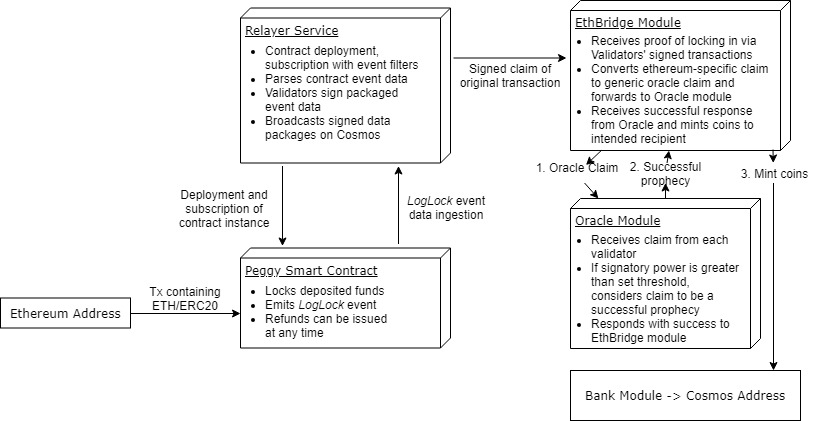

# Ethereum Cosmos Bridge Architecture

Unidirectional Peggy focuses on core features for unidirectional transfers. This prototype includes functionality to safely lock and unlock Ethereum, and mint corresponding representative tokens on the Cosmos chain.

The architecture consists of 4 parts. Each part, and the logical flow of operations is described below.

## The smart contracts

First, the smart contract is deployed to an Ethereum network. A user can then send Ethereum to that smart contract to lock up their Ethereum and trigger the transfer flow.

In this prototype, the system is managed by the contract's deployer, designated internally as the relayer, a trusted third-party which can unlock funds and return them their original sender. If the contract’s balances under threat, the relayer can pause the system, temporarily preventing users from depositing additional funds.

It is not the goal of these contracts to create a production-grade system for cross-chain value transfers which enforces strict permissions and limits access to locked funds. The goal of the current smart contracts is to securely implement core functionality of the system such as asset locking and event emission without endangering any user funds. As such, this prototype does not permanently lock value and allows the original sender full access to their funds at any time. As stated above, do NOT use unaudited smart contracts on the mainnet.

The Peggy Smart Contract is deployed on the Ropsten testnet at address: 0xec6df30846baab06fce9b1721608853193913c19. More details on the smart contracts and usage can be found in the testnet-contracts folder.

## The Relayer

The Relayer is a service which interfaces with both blockchains, allowing validators to attest on the Cosmos blockchain that specific events on the Ethereum blockchain have occurred. Through the Relayer service, validators witness the events and submit proofs in the form of signed hashes to the Cosmos based modules, which are responsible for aggregating and tallying the Validators’ signatures and their respective signing power.

The Relayer process is as follows:

- continually listen for a `LogLock` event
- when an event is seen, parse information associated with the Ethereum transaction
- uses this information to build an unsigned Cosmos transaction
- signs and send this transaction to Tendermint.

## The EthBridge Module

The EthBridge module is a Cosmos-SDK module that is responsible for receiving and decoding transactions involving Ethereum Bridge claims and for processing the result of a successful claim.

The process is as follows:

- A transaction with a message for the EthBridge module is received
- The message is decoded and transformed into a generic, non-Ethereum specific Oracle claim
- The oracle claim is given a unique ID based on the nonce from the ethereum transaction
- The generic claim is forwarded to the Oracle module.

The EthBridge module will resume later if the claim succeeds.

## The Oracle Module

The Oracle module is intended to be a more generic oracle module that can take arbitrary claims from different validators, hold onto them and perform consensus on those claims once a certain threshold is reached. In this project it is used to find consensus on claims about activity on an Ethereum chain, but it is designed and intended to be able to be used for any other kinds of oracle-like functionality in future (eg: claims about the weather).

The process is as follows:

- A claim is received from another module (EthBridge in this case)
- That claim is checked, along with other past claims from other validators with the same unique ID
- Once a threshold of stake of the active Tendermint validator set is claiming the same thing, the claim is updated to be successful
- If a threshold of stake of the active Tendermint validator set disagrees, the claim is updated to be a failure
- The status of the claim is returned to the module that provided the claim.

## The EthBridge Module (Part 2)

The EthBridge module also contains logic for how a result should be processed.

The process is as follows:

- Once a claim has been processed by the Oracle, the status is returned
- If the claim is successful, new tokens representing Ethereum are minted via the Bank module

## Architecture Diagram

